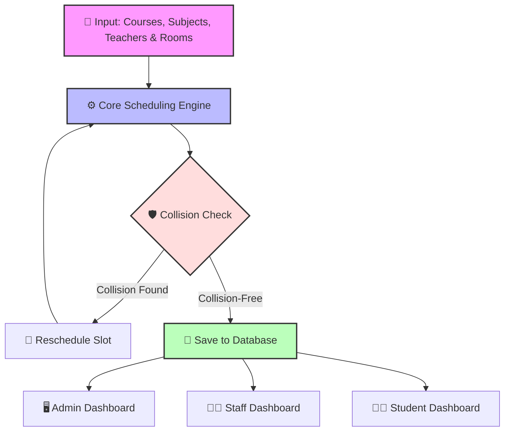
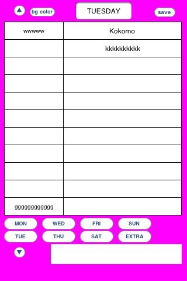

<p align="center">
  
</p>

<p align="center">
  
  <h1 align="center" style="display: inline-block;">📅 Automatic Timetable Generator</h1>
</p>

<p align="center">
  <a href="https://github.com/vijaymahes9080/timetable-php"></a>
  
  
  
  
  
</p>

---

## 🌟 Introduction

Generating class schedules manually is time-consuming and prone to scheduling conflicts. The **Automatic Timetable Generator** is an intelligent web platform designed to automatically build optimal, collision-free timetables for educational institutions. It ensures that class hours, professors, subjects, and classrooms are aligned perfectly without overlaps.

---

## 📐 System Flow & Architecture



---

## 📸 Interface Screenshots

### 🖥️ Dashboard & Scheduler Previews

<table align="center">
  <tr>
    <td align="center" width="50%">
      <br />
      <b>📈 Interactive Scheduler View</b>
    </td>
    <td align="center" width="50%">
      <br />
      <b>🖥️ Management Dashboard</b>
    </td>
  </tr>
  <tr>
    <td align="center" width="50%">
      <br />
      <b>📋 Exam & Classroom Mapping</b>
    </td>
    <td align="center" width="50%">
      <br />
      <b>⚙️ Scheduler Settings & Configurations</b>
    </td>
  </tr>
</table>

### 📱 User & Module Previews

<table align="center">
  <tr>
    <td align="center" width="50%">
      <br />
      <b>🔒 Secure Authentication Gateway</b>
    </td>
    <td align="center" width="50%">
      <br />
      <b>🏫 Departmental Configurations</b>
    </td>
  </tr>
  <tr>
    <td align="center" width="50%">
      <br />
      <b>👩‍🏫 Lecturer & Faculty Allocations</b>
    </td>
    <td align="center" width="50%">
      <br />
      <b>🎓 Student Timetable Portal</b>
    </td>
  </tr>
</table>

---

## ⚡ Key Highlights

- **🤖 Automated Generation**: Computes optimal teacher-subject-slot combinations automatically.
- **🛡️ Collision Detection**: Built-in validation checks ensure no teacher or classroom is double-booked.
- **📊 Role-Based Control**:
  - **Admin**: Complete system overview (teachers, subjects, courses, slots).
  - **Staff**: Dedicated dashboard to check class schedules, profiles, and slots.
  - **Student**: Simple interface to view, export, or print semester-wise timetables.
- **⚡ Fast Web Architecture**: Utilizes AJAX dynamic queries for instant updates.

---

## 📂 Project Directory Structure

```text
timetable/
│
├── admin/            # Admin Panel templates, assets & scripts
├── staff/            # Staff Panel files and configuration
├── student/          # Student Portal views
├── database/         # Database SQL schemas
├── img/              # Primary site imagery and banners
├── images/           # UI screenshots and module illustrations
├── css/              # Shared Cascading Style Sheets
├── js/               # Shared JavaScript files
├── config.php        # Core Database Configurations
└── index.php         # Main landing page
```

---

## 🛠️ Installation & Setup

1. **Clone the Repo**:
   ```bash
   git clone https://github.com/vijaymahes9080/timetable-php.git
   ```
2. **Move to Web Directory**: Place the `timetable` directory in your local Apache `htdocs` or `www` folder.
3. **Database Import**:
   - Create a database in MySQL named `timetable`.
   - Import files located in the [database/](file:///d:/BACKUP/projects/PHP%20project/timetable/database) directory.
4. **Connect Database**:
   - Update database username, password, and hostname in [config.php](file:///d:/BACKUP/projects/PHP%20project/timetable/config.php).
5. **Access App**: Launch your web browser and open `http://localhost/timetable/`.

---

## 👥 Authorship & Contributions

👤 **Vijay Mahes**
* Email: [Vijaypradhap2004@gmail.com](mailto:Vijaypradhap2004@gmail.com)
* GitHub: [@vijaymahes9080](https://github.com/vijaymahes9080)

---

## 📄 License

This project is licensed under the MIT License - see the [LICENSE](LICENSE) file for details.
